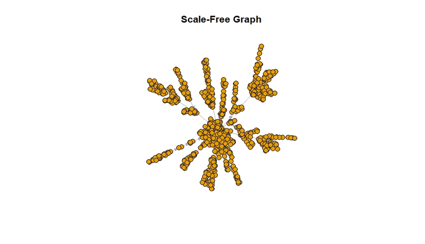
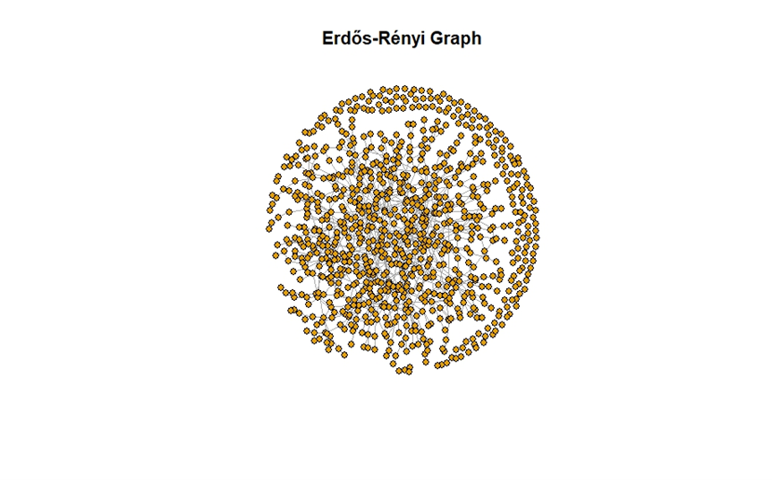
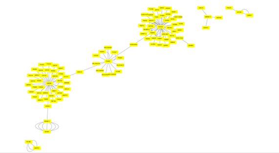
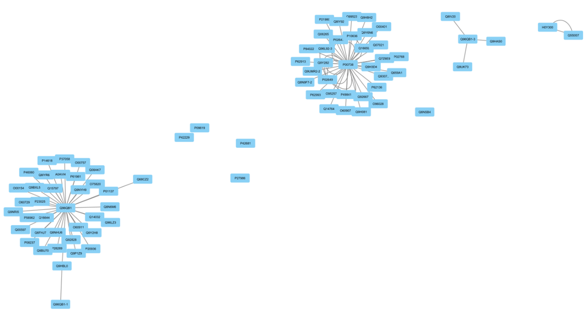
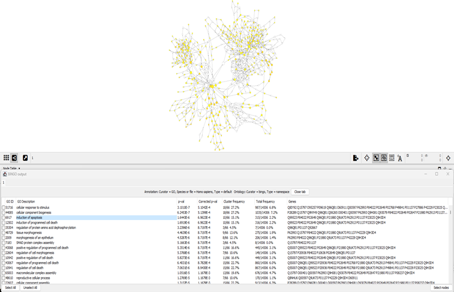

# 🧠 Network Analysis in Systems Biology

This project demonstrates the application of graph theory to biological networks, comparing simulated scale-free and Erdős–Rényi networks, and exploring disease-relevant protein–protein interaction modules using Cytoscape and BiNGO.

---

## 🔬 Project Goals

- Model scale-free and random networks in R using `igraph`
- Compare topological metrics (degree, clustering, path length)
- Detect modules using edge betweenness community detection
- Import and explore human PPI networks using Cytoscape + IMEx
- Conduct functional enrichment analysis via BiNGO
- Interpret hub genes and subnetworks with immune relevance

---

## 📊 Network Model Comparison

Simulated 100-node networks:

| Metric                | Scale-Free Network | Erdős–Rényi Network |
|-----------------------|--------------------|---------------------|
| Average Degree        | 3.2                | 3.1                 |
| Clustering Coefficient| 0.22               | 0.04                |
| Average Path Length   | 3.5                | 4.8                 |

📄 Full CSV: [`topology_metrics_table.csv`](results/topology_metrics_table.csv)

---

## 🖼️ Visualizations

### Scale-Free Network (Barabási–Albert Model)


### Erdős–Rényi Random Network


### Cytoscape Protein–Protein Interaction Network


### Subnetwork from Homo sapiens


### GO Enrichment from BiNGO


---

## 📂 Project Structure

```
Network-Analysis-Systems-Biology/
├── src/
│   └── network_comparison.R
├── results/
│   └── topology_metrics_table.csv
├── figures/
│   ├── scale_free_graph.png
│   ├── erdos_renyi_graph.png
│   ├── cytoscape_network.png
│   ├── subnetwork_human.png
│   └── enrichment_terms.png
├── README.md
```

---

## 🚀 How to Reproduce

1. Open `network_comparison.R` and run the script in RStudio
2. Requires: `igraph`, `ggplot2`, `Cytoscape` + BiNGO plugin
3. Import `.txt` or `.sif` file into Cytoscape from IMEx

---

## 🧠 Author

**Fares Ibrahim**  
Bioinformatician | Systems Biology | Network Medicine  
🔗 [GitHub](https://github.com/Fares77-a11y)

---

## 📄 License

MIT License — see `LICENSE` file for terms.
